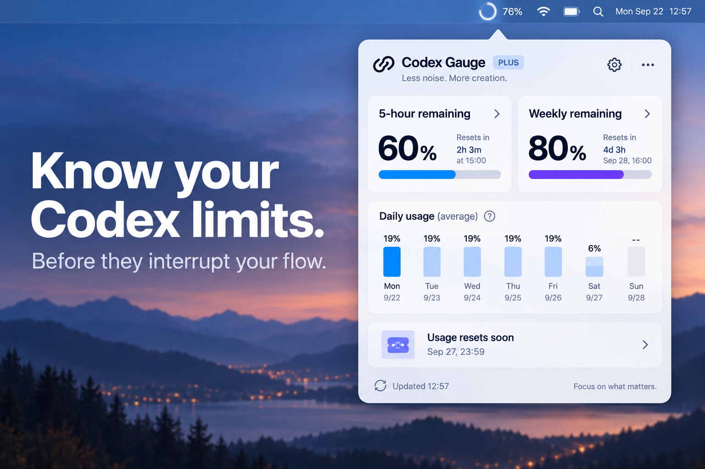
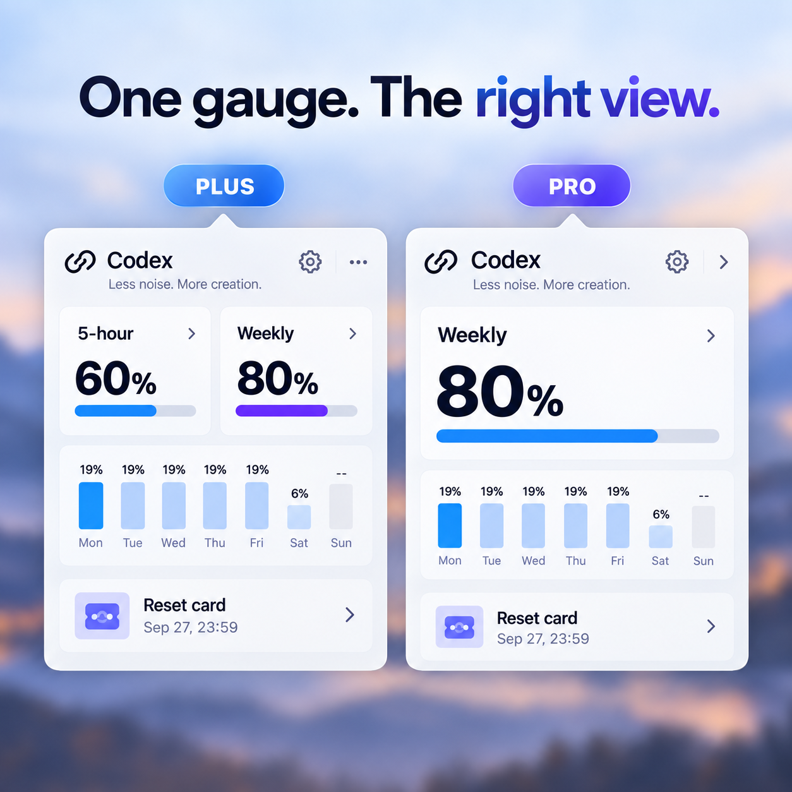
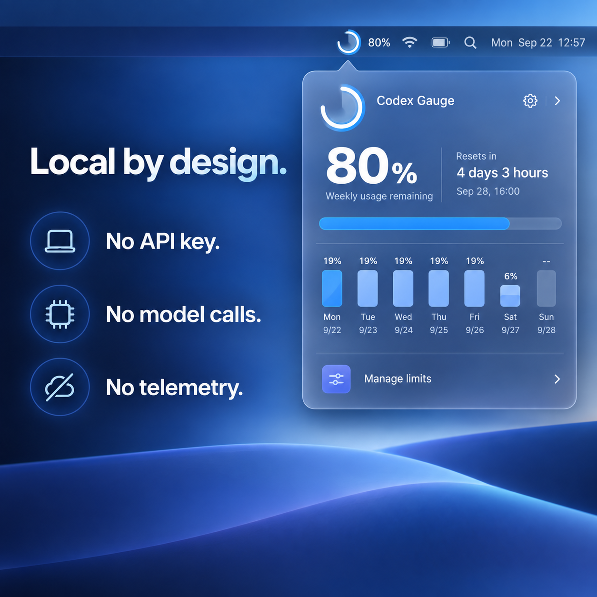

# Codex Gauge

[English](README.md) · [简体中文](README.zh-CN.md)

Codex Gauge 是一个安静、开源的 macOS 菜单栏用量监控器。它直接读取本机 Codex App Server 的账户额度，不会发起模型对话，让你在工作被额度打断之前看清剩余用量。

当前版本：`0.2.7` · 本项目为社区开源工具，并非 OpenAI 官方产品。



## 界面

菜单栏使用紧凑的单图标：外圈进度线表示剩余用量，内侧半透明扇形表示当前额度周期的剩余时间，中心只显示用量整数，两项指标均从十二点钟方向开始。鼠标悬浮自动打开面板，离开图标和面板后自动收起。面板内显示：

- 剩余用量与距离下次重置的时间
- 自动识别套餐，无需手动切换
- Plus 同时显示 5 小时额度和周额度
- Pro / Prolite 显示精简的主额度界面
- 按剩余时间分配的每日额度
- 账户的可用重置卡数量、最早过期时间和卡片明细
- 简体中文与英文界面，自动跟随 macOS 系统语言

应用不做用量预警，不申请系统通知权限。重置卡页面只展示信息，不会自动使用卡片。



## 安装已发布版

从 [GitHub Releases](https://github.com/nb851224/codex-gauge/releases) 下载最新的 `Codex-Gauge-v0.2.7-macOS-arm64.zip`，解压后打开 `Codex Gauge.app`。

当前预编译包适用于 Apple Silicon，需要 macOS 13 或更高版本；Intel Mac 可从源码自行构建。

当前发布包使用本地签名，未经 Apple 公证。如 macOS 首次拦截，请在 Finder 中右键应用并选择“打开”，或从源码自行构建。

## 从源码构建

需要 macOS 13 或更高版本、Swift 5.10+，以及已登录的 Codex CLI。

```bash
cd codex-gauge
chmod +x Scripts/build-app.sh
Scripts/build-app.sh
open "dist/Codex Gauge.app"
```

开发时也可以直接运行：

```bash
swift run CodexGauge
```

## 隐私和用量

- 数据来自本机 `codex app-server --stdio`。
- 不调用模型，不会为刷新额外生成 Codex 推理用量。
- 用量样本只保存在本机 `UserDefaults`，最长保留 30 天。
- 收到 App Server 用量更新时立即刷新，另每 5 分钟兜底刷新。
- 每次点击菜单栏百分比打开面板时，也会立即查询一次最新用量。
- 不需要 API Key，不收集遥测。



## 参与早期验证

如果你正在使用 Codex Plus、Pro 或 Prolite，欢迎在 [早期反馈帖](https://github.com/nb851224/codex-gauge/issues/1) 留下实际体验。我们当前最想确认：套餐与额度是否识别正确、菜单栏图标是否一眼可读，以及你是否需要 Intel、Homebrew 或 Apple 公证版本。

## 许可证

[MIT License](LICENSE)
